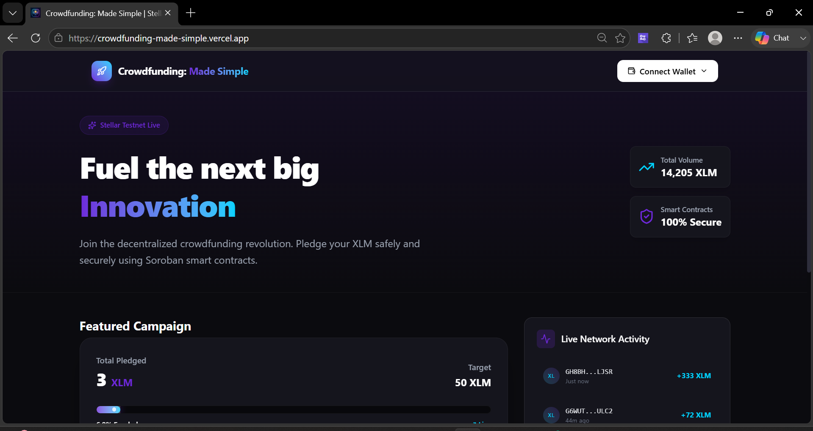
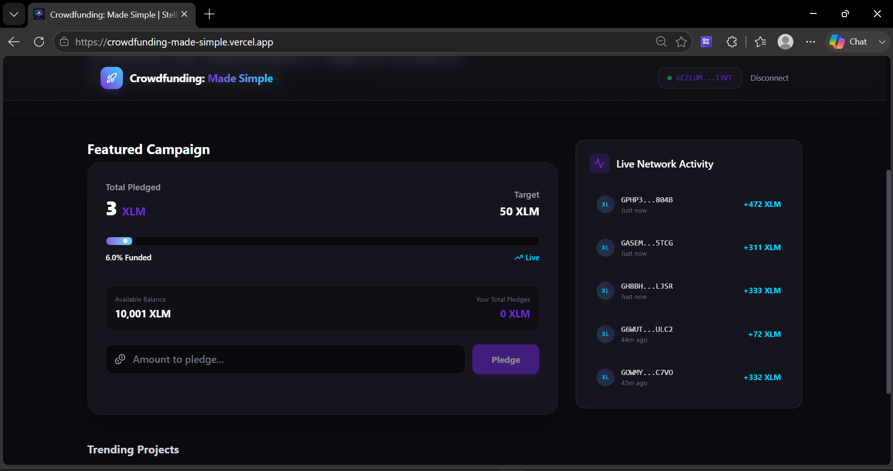
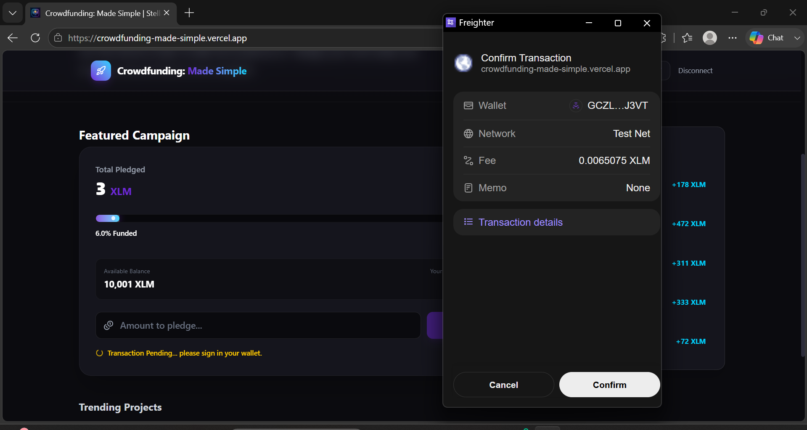
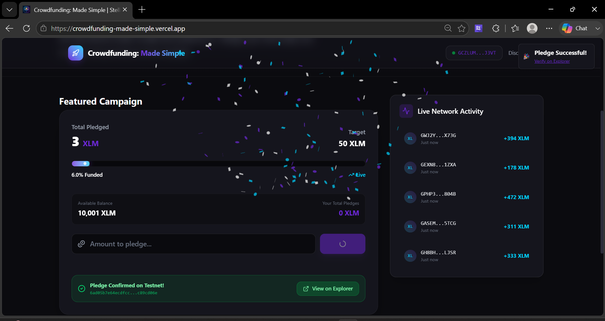
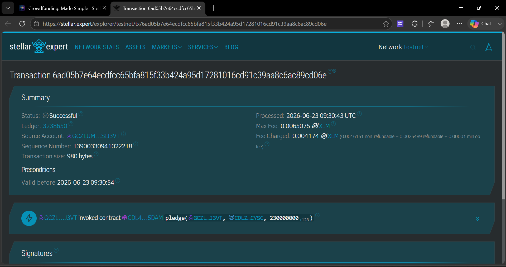

# 🚀 Crowdfunding: Made Simple

> A decentralized crowdfunding platform powered by **Stellar Soroban smart contracts** — pledge XLM transparently, securely, and on-chain.

<div align="center">

[](https://crowdfunding-made-simple.vercel.app)
[](https://stellar.org)
[](https://soroban.stellar.org)

</div>

---

## 📸 Screenshots

| Dashboard | Connect Wallet |
|:---------:|:--------------:|
|  |  |

| Connected & Balance | Sign Transaction |
|:-------------------:|:----------------:|
|  |  |

| Pledge Success | Explorer Verified |
|:--------------:|:-----------------:|
|  |  |

---

## ✨ Features

- 🔗 **Wallet Connect** — Supports Freighter & Albedo wallets via `@creit.tech/stellar-wallets-kit`
- 💰 **Live XLM Balance** — Shows your available balance immediately after connecting
- 📊 **Real-time Progress Bar** — Animated bar showing funded % of the 50 XLM target
- 💸 **On-chain Pledging** — Pledges trigger a real Soroban smart contract transaction
- ✅ **Stellar Explorer Link** — Every successful pledge shows a direct link to verify the transaction on `stellar.expert`
- 📝 **Pledge History** — Tracks your total pledges per-wallet using contract storage
- 🎉 **Confetti + Toast** — Rich success feedback after each pledge
- 🔴 **Live Event Feed** — Real-time feed of recent pledges

---

## 🛠 Tech Stack

| Layer | Technology |
|-------|-----------|
| **Smart Contract** | Rust · Soroban SDK · WebAssembly |
| **Frontend** | React 19 · TypeScript · Vite |
| **Blockchain SDK** | `@stellar/stellar-sdk` v16 |
| **Wallet Integration** | `@creit.tech/stellar-wallets-kit` |
| **Styling** | Tailwind CSS v4 |
| **Deployment** | Vercel (frontend) · Stellar Testnet (contract) |

---

## 📋 Smart Contract Details

**Contract ID (Testnet):**
```
CDL4SNU7TUNK2NA3EU34WALUPPMDFJOBK4GZJ3S44SGDZEOXWBA35DAM
```

**Verify on Stellar Expert:**
🔗 [View Contract on Explorer](https://stellar.expert/explorer/testnet/contract/CDL4SNU7TUNK2NA3EU34WALUPPMDFJOBK4GZJ3S44SGDZEOXWBA35DAM)

---

### 🧾 Transaction Hashes (Verifiable `pledge()` calls on Testnet)

These are real, on-chain invocations of the `pledge()` function on this contract:

| # | Transaction Hash | Explorer Link |
|---|------------------|---------------|
| 1 | `09b33a274f1c2a5f028d8131ab9d7560a42855f6bf52a6ed72cbe95f0c4dcef7` | [View on Stellar Expert ↗](https://stellar.expert/explorer/testnet/tx/09b33a274f1c2a5f028d8131ab9d7560a42855f6bf52a6ed72cbe95f0c4dcef7) |
| 2 | `c94020533cecab420279ec7f7188c3d91ebb2c8d77a66881885cfd6110b794b9` | [View on Stellar Expert ↗](https://stellar.expert/explorer/testnet/tx/c94020533cecab420279ec7f7188c3d91ebb2c8d77a66881885cfd6110b794b9) |
| 3 | `6ad05b7e64ecdfcc65bfa815f33b424a95d17281016cd91c39aa8c6ac89cd06e` | [View on Stellar Expert ↗](https://stellar.expert/explorer/testnet/tx/6ad05b7e64ecdfcc65bfa815f33b424a95d17281016cd91c39aa8c6ac89cd06e) |

---

### 👛 Wallet Options Available

The app supports multiple wallets via the connect modal:


### Contract Functions

| Function | Description |
|----------|-------------|
| `init(admin, target, deadline)` | Initializes the campaign with target amount and deadline |
| `pledge(caller, token, amount)` | Transfers XLM from pledger to contract; updates state & emits event |
| `get_pledged()` | Returns total XLM pledged so far |
| `get_target()` | Returns the campaign funding target |

### Contract Architecture
```rust
// On-chain storage keys
enum DataKey {
    Admin,                 // Campaign admin address
    Target,                // Funding target (in stroops)
    Pledged,               // Total pledged so far
    Deadline,              // Unix timestamp deadline
    UserPledge(Address),   // Per-user pledge tracking
}
```

---

## 🚀 Run Locally

### Prerequisites
- Node.js v18+
- Rust + `wasm32-unknown-unknown` target
- Freighter or Albedo wallet browser extension (set to **Testnet**)

### Frontend
```bash
# Clone the repo
git clone https://github.com/anukri7970/Crowdfunding-Made-simple.git
cd Crowdfunding-Made-simple/frontend

# Install dependencies
npm install

# Create .env file
echo "VITE_CONTRACT_ID=CDL4SNU7TUNK2NA3EU34WALUPPMDFJOBK4GZJ3S44SGDZEOXWBA35DAM" > .env

# Start dev server
npm run dev
```

### Smart Contract (optional — already deployed)
```bash
cd contracts/eventfund

# Build WASM
cargo build --target wasm32-unknown-unknown --release

# Deploy (uses deploy.js script)
cd ../../frontend
node scripts/deploy.js
```

---

## 🔄 User Flow

```
1. Open app → Connect Freighter wallet (Testnet)
      ↓
2. See your XLM balance + campaign progress
      ↓
3. Enter pledge amount → Click "Pledge"
      ↓
4. Freighter pops up → Approve the transaction
      ↓
5. Transaction confirmed on Stellar Testnet
      ↓
6. Green banner appears with Stellar Explorer link ✅
```

---

## 📁 Project Structure

```
level 2/
├── contracts/
│   └── eventfund/
│       ├── src/
│       │   ├── lib.rs        # Soroban smart contract
│       │   └── test.rs       # Unit tests
│       └── Cargo.toml
├── frontend/
│   ├── src/
│   │   ├── components/
│   │   │   ├── CampaignCard.tsx    # Main pledge UI
│   │   │   ├── WalletConnect.tsx   # Wallet integration
│   │   │   └── RecentPledges.tsx   # Live event feed
│   │   ├── hooks/
│   │   │   ├── useContract.ts      # Soroban RPC calls
│   │   │   └── useContractEvents.ts
│   │   └── App.tsx
│   ├── scripts/
│   │   └── deploy.js         # Contract deployment script
│   └── index.html
└── screenshots/              # App screenshots
```

---

## 🌐 Live Deployment

| | Link |
|--|------|
| **Frontend** | https://crowdfunding-made-simple.vercel.app |
| **Contract** | [stellar.expert/explorer/testnet/contract/CDL4...](https://stellar.expert/explorer/testnet/contract/CDL4SNU7TUNK2NA3EU34WALUPPMDFJOBK4GZJ3S44SGDZEOXWBA35DAM) |
| **Network** | Stellar Testnet |
| **RPC** | https://soroban-testnet.stellar.org |

---

## 👤 Author

**Anukri** — [@anukri7970](https://github.com/anukri7970)

---

<div align="center">
  Built with ❤️ on <strong>Stellar Soroban</strong>
</div>
